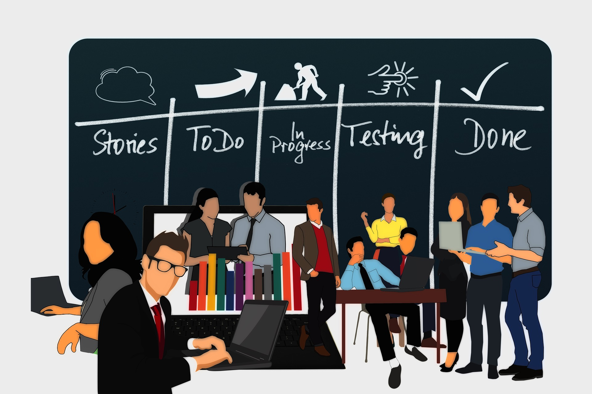

# Kanban

> ## Terms used
>
> - **Kanban** - a workflow management method for defining, managing, and improving services that deliver knowledge work. It aims to help you visualize your work, maximize efficiency, and improve continuously. [^1]
> - **Backlog** - an accumulation of uncompleted work that needs to be dealt with
> - **Agile** - In software development, agile practices involve discovering requirements and developing solutions through the collaborative effort of self-organizing and cross-functional teams and their customer/end user. [^2]
> - **Scrum** - An agile mindset for developing, delivering, and sustaining complex products,mostly defined by sprints and increments. [^3]

## Kanban (in software development)

Kanban is a flavor of Agile methodology as an approach to build software.

This approach have many similarities and overlaps to another popular agile approach to software development called [Scrum](https://dev.to/menard_codes/a-quick-guide-about-scrum-5485).

In a nutshell, you break down a project into multiple software requirements which then becomes the product backlog of the Kanban board. The team then plans how to move the backlog into tasks under **To-Do** column. That's when the team will work on the task until it's defined as **Done**.

## Planning

Kanban is less strict compared to Scrum, because in Scrum, meetings are fixed on the schedule (like the daily scrum, sprint planning, sprint retrospective, etc.). Meanwhile, in kanban, meetings can be held whenever there's capacity, or held meetings in demand, and there can also be meetings on planning for example.

During the meetings, the team analyzes the backlog and plan the **"To-Do"** and moves tasks here.

## Cycle time and Lead time

In Kanban, we have **Cycle Time** which measures how long does it take for a task to move from **To-Do status** to **Done**.

This is similar to **Velocity** in Scrum.

This metric tells how efficient a team is on their work. A *lower cycle time* tells that the team can finish tasks in a shorter period of time, reflecting their productivity is high.

## Kanban Board

The kanban board is perhaps the core of this idea, so to speak. This board is a nice visual representation of the progress of a project.

Normally, the kanban board consists of the **Backlog**, the **To-Do**, **In-progress**, and **Done**.

Some teams prefer to add or modify the columns depending on their needs, even mixing it with scrum, since it's very similar to the scrum board.

You might find there columns for blockers, to-verify or to-test, rejected, etc.

Often, the top priority tasks like those involved directly in the business are placed on top of the board.

### Limits

On a Kanban board, teams set limits to columns on the board, such as the *Todo* column or *To-test* column.

This is a little different to Scrum where the limit is set for the entire scrum board rather than per column.

Such limits are placed to meet the team's cycle time, and to also figure out which process gives them a bottleneck where the team needs to discuss how to clean it up.

## Final Thoughts

Kanban is a great way to manage your projects, and can also be applicable to other areas outside software development.

Developers can boost their productivity by dividing the problems into isolated and independent chunks of tasks, while also understanding the progress of their work.

## My Link

Follow me on twitter!
[@menard_codes](https://twitter.com/menard_codes)

[^1]: [Kanbanize](https://kanbanize.com/kanban-resources/getting-started/what-is-kanban)
[^2]: [Agile software development - Wikipedia](https://en.wikipedia.org/wiki/Agile_software_development)
[^3]: [Scrum - Wikipedia](https://en.wikipedia.org/wiki/Scrum_(software_development))