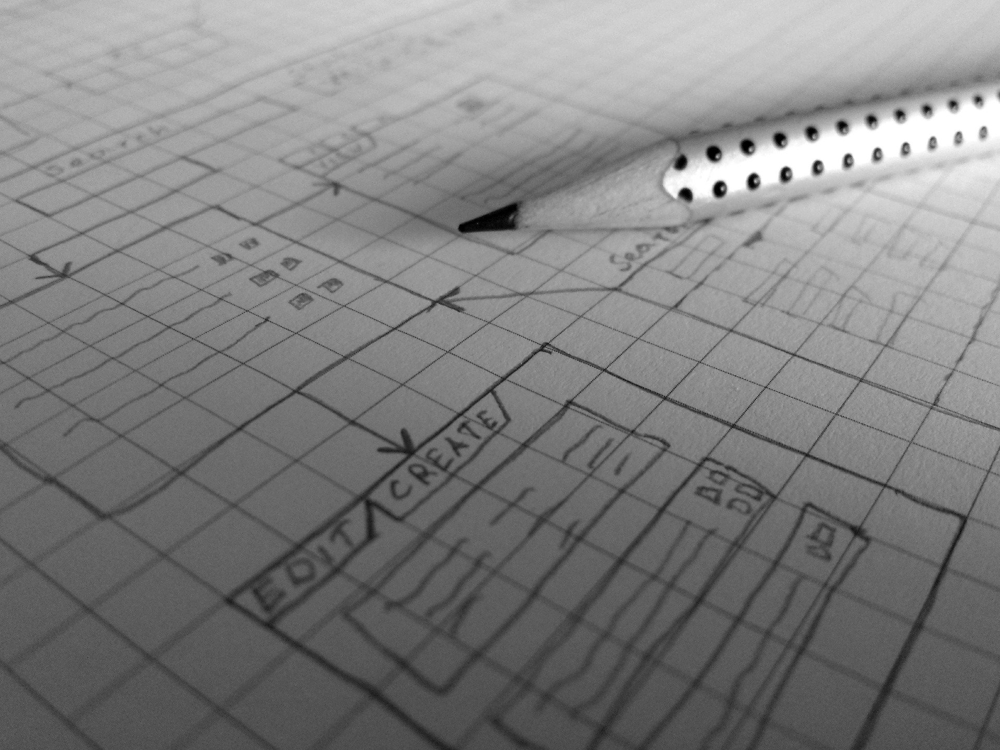

# Planning your next Software Project

**NOTE:** *I'm currently studying software development and Agile, and this blog is a journal of what I just learned about Planning a software product. If you found something is not quite right, please let me know, I love learning from people!*

Maybe you once got an idea about a software that you're excited about, but during development phase, you noticed how entangled your project became, and it's hard to keep track of things or even see your progress.

Or maybe you're like me who always wants to jump right into code once an idea pops up into our head.

Here is when a good planning; and maybe some research; comes in.

So how do we start planning?

## Start simple

If you're familiar about ["Scrum"](https://dev.to/menard_codes/a-quick-guide-about-scrum-5485), we know that we don't plan our software too specific at start, but instead, we list down the high-level requirements of features of our project (under the product backlog).

This might be login and sign up, dashboard, account settings, etc.

From there, we plan our sprint with a duration of 1-4 weeks where we take a requirement from the product backlog, breaks it down further into smaller chunks of todos, and aims to achieve the goal to finish the todos under sprint backlog after the current sprint.

After each and every sprint, we get an increment, or a *'potentially shippable'* product.

Through this, we can plan out and develop the software quickly without wasting too much time (or even release it to the market prematurely, depending on the product and requirements, or the product owner).

With an agile mindset, we don't need to plan out everything from start, but instead, we start simple, plan simple, and build incrementally the product.

And that's the philosophy of Agile.

We can dive deeper on an issue further down the road or even find an edge case or opportunity that we haven't thought of during planning.

So start small, have a list of rough ideas or features of your project, take one, break it further down, and dedicate a timeline for your next sprint to develop that feature, then continuously repeat the process. From that, we can build incrementally our software from idea to real world product (perhaps even sell or make money from it!).

### The MVP

MVP or Minimum Viable Product is a very common word in the startup world.

The idea is you build the core features of your product that can at least represent your idea or solution that is useful to your target market.

Just for an example, let's say you're planning to build a car. Since it's expensive, complicated, and hard to build, you can start simple and build a skateboard instead. This very minimal product can represent in some way your vision of a vehicle. Not to mention that it's easier and cheaper to build than a car. The best part is that people can even start using it and you can even start selling it to them. From then on, you can incrementally improve and add features to your product, maybe turn it into a scooter, then to a bike, into a motorcycle, and once you had more experience (and hopefully some cash from previous sales) the car.

So start small, it's better to start somewhere and simpler, than too complex and never shipped to market at all.

## Product (or project) Roadmap

This is very common to development teams, more often planned by a product manager.

The product roadmap is a nice visual representation or guide of how you plan to develop the software overtime.

You specify some todos and align them over a period of time or sprints.

Since we're doing things the agile way, our deadlines may also be a rough estimate and change depending on the situation or requirements.

## Product (or project) requirements

The product requirements further analyzes the product or feature/s, how it aligns with the vision of the business or the product, and some other metrics such as customer's problems, KPI, etc.

From this, we understand more about what we are building, gain insight from it (such as whether it's still ideal to produce or not), or maybe we find possible pitfalls, etc.

## Backlog

And here comes the list of the things the team needs to do.

On Scrum, we start from a Product backlog, which lists down the higher level requirements of our software.

The other one is Sprint backlog, which are more specific requirements and serves as source for the todo column of the Scrum or Kanban board for the next sprint.

This serves as our guide on what to build, and helps us boost our performance as well.

## Final Thoughts

Building our next software project can be easier if we plan things out before we start, because a good planning will save us tons of frustrations about the complexity of our project, and also gives us a clear picture of our progress.

Also, we don't need to start complex. It is ideal that we begin simple and small, then gradually build it from the ground up.

It will be even better if we can sell our software project or make it as a side business (another stream of income can be very rewarding, isn't it?).

Hopefully this helps, and goodluck for your next project!

## My link
Follow me on [Twitter](twitter.com/menard_codes)!
